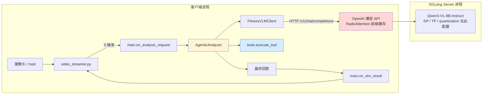
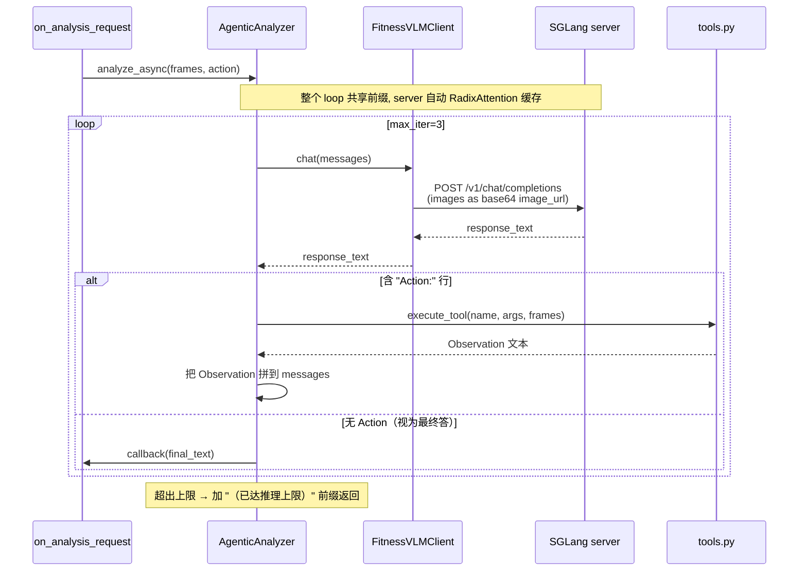
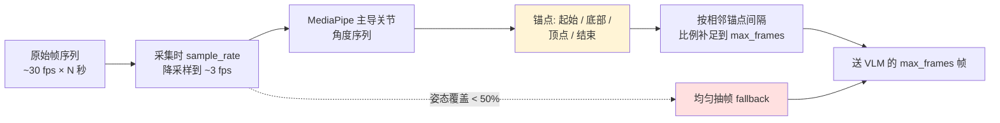

# Workout Coach — Qwen3-VL 健身动作质量评估

> 基于 **Qwen3-VL-8B-Instruct** 的健身动作质量评估系统。推理由独立的 **SGLang server** 承载,本进程仅作客户端 + agentic 调度器。
> 客户端按 **ReAct 协议**驱动模型多轮工具调用(MediaPipe 姿态分析),SGLang 的 RadixAttention 自动复用多轮共享前缀的 KV cache。


---

## 核心亮点

- **SGLang 推理后端**:独立 server 进程,OpenAI 兼容 API。RadixAttention 自动复用 agentic 多轮的公共前缀 KV cache,降低多轮延迟
- **Agentic 工具调用循环**:模型按 ReAct 协议输出 `Action:` / `Action_Input:`,runtime 执行工具并把 Observation 回灌,最多 3 轮迭代
- **MediaPipe 姿态工具**:`get_pose_angles`(指定帧的 7 个关节角度)+ `detect_phase_boundaries`(自动定位起始/底部/顶点/结束)
- **相位锚定抽帧**(默认):送 VLM 前先用 MediaPipe 主导关节角度锚定 起始/底部/顶点/结束 4 个关键帧,剩余预算按时间间隔比例补齐;借鉴 HiERO 用语义聚类挑代表帧的思路,但用关节角度替代视频特征,无需训练
- **任意动作支持**:不依赖预设动作库,模型先识别画面里的实际动作,与用户声明对比后再评估
- **双输入模式**:摄像头实时拍摄 / 本地 mp4 文件,按 **S** 触发分析、**Q** 退出
- **多卡并行**:在 SGLang server 启动时通过 `--dp-size` / `--tp-size` 配置,客户端无需关心
- **内置对比评测脚本**:`benchmark.py` 对比 agentic vs 非 agentic、phase_anchored vs uniform 在延迟、格式合规、动作识别、问题填充等维度上的差异

---

## 整体架构



---

## 文件结构

```
Workout-Coach/
├── input/                        # 待分析的本地视频文件
├── scripts/
│   ├── install.sh                # 顺序敏感的依赖安装脚本（必须用这个）
│   └── launch_sglang.sh          # 启动 SGLang server
├── action_profiles.py            # Prompt 构建：单次 + agentic
├── tools.py                      # MediaPipe 姿态工具 + 工具注册表 + execute_tool
├── agent_loop.py                 # AgenticAnalyzer：ReAct 循环 + LoopStats
├── vlm_inference.py              # FitnessVLMClient：SGLang OpenAI 兼容 API 薄客户端
├── video_streamer.py             # 视频采样、缓冲与触发
├── main.py                       # 客户端主程序入口
├── benchmark.py                  # Agentic vs 非 agentic 对比评测
├── bench_manifest.example.json   # 评测样本清单模板
├── download_model.py             # 模型预下载脚本（HF / ModelScope）
├── config.env.example            # 客户端环境变量模板
└── requirements.txt              # leaf 依赖（不含 torch/sglang/flashinfer）
```

---

## 安装(顺序敏感)

> ⚠️ **不要直接 `pip install -r requirements.txt`**。SGLang / FlashInfer 的 wheel 与 (CUDA, PyTorch 主次版本) 强绑定;一次性 pip 解析多个包会得到互不兼容的版本。请用脚本按顺序装。

```bash
# 1. 干净的 conda 环境
conda create -n workout-coach python=3.11 -y
conda activate workout-coach

# 2. 按顺序安装：torch → flashinfer → sglang → 项目 leaf 依赖
bash scripts/install.sh
# 默认 CUDA 12.1 / Torch 2.5.1。要改：
#   CUDA_VARIANT=cu118 TORCH_VERSION=2.4.1 bash scripts/install.sh
```

`install.sh` 会依次:

```mermaid
flowchart LR
    A[Step 1<br/>torch] --> B[Step 2<br/>flashinfer-python<br/>matching CUDA+torch index]
    B --> C[Step 3<br/>sglang &#91;all&#93;]
    C --> D[Step 4<br/>requirements.txt<br/>opencv / mediapipe / openai / ...]
    style A fill:#d6ecff
    style B fill:#d6ecff
    style C fill:#ffd6d6
    style D fill:#fff4d6
```



为什么顺序重要:

| Step | 装错位置会怎样 |
|---|---|
| **torch 不先装** | flashinfer / sglang 各自挑 torch 版本,可能彼此不兼容 |
| **flashinfer 后装** | sglang 启动报"flashinfer not found"或 ABI 错误 |
| **requirements.txt 先装** | numpy / opencv 把 sglang 已固定的版本反向降级 |

---

## 启动与使用

```bash
# 1. 下载模型（国内可用 ModelScope）
python download_model.py --model Qwen/Qwen3-VL-8B-Instruct --source modelscope

# 2. 配置 .env
cp config.env.example .env
# 编辑 .env：SGLANG_ENDPOINT、VLM_MODEL_NAME、HF_HOME 等

# 3. 终端 A：启动 SGLang server（独立进程，常驻）
bash scripts/launch_sglang.sh
# 调参示例：4 卡数据并行
#   SGLANG_DP_SIZE=4 bash scripts/launch_sglang.sh

# 4. 终端 B：运行客户端
python main.py
```

**操作流程**:启动后选择视频源 → 输入动作名称 → 文件模式自动触发 / 摄像头模式按 **S** 触发分析 → 按 **Q** 退出。

---

## Agentic 推理循环

模型每轮选择"调用工具"或"直接答":



**ReAct 协议**(注入 system prompt):

```
Thought: 需要确认蹲底时的膝关节角度
Action: get_pose_angles
Action_Input: {"frame_indices": [3, 4, 5]}
```

最终回答不带 tag,直接输出 `【画面动作】/【总体结论】/【关键问题1-3】/【下一组执行口令】` 结构。

**可用工具**(位于 [tools.py](tools.py)):

| 工具 | 参数 | 返回 | 适用场景 |
|---|---|---|---|
| `get_pose_angles` | `frame_indices: List[int]` | 每帧的左右膝/髋/肘 + 躯干前倾角(°) | 需要量化某些时刻的姿态 |
| `detect_phase_boundaries` | 无 | 起始/底部/顶点/结束帧序号 + 关键角度极值 | 需要先定位"哪一刻最值得细看" |

**帧编号**:初始 user message 把每帧前面加文字 `第N帧:`,让模型能稳定引用帧索引。

---

## 抽帧策略 (Phase-Anchored Sampling)

送给 VLM 的最终帧数受 `VLM_MAX_FRAMES`(默认 8)限制。怎么从一段几秒的视频里挑这 8 帧,决定模型能不能看到关键动作瞬间。



| 策略 | 行为 | 适用 |
|---|---|---|
| `phase_anchored`(默认) | MediaPipe 算每帧主导关节(深蹲=膝,卧推=肘)角度;取 min/max 作底部/顶点,首尾作起始/结束;剩余预算按锚点间隔比例分配 | 真实健身视频(几秒一次完整 rep) |
| `uniform` | 索引按 `step=N/max_frames` 等步长取 | 与旧版对比基线 / mediapipe 不可用时的 fallback |

**为什么是这个设计**:论文 HiERO 的核心论点是"均匀抽帧会浪费帧预算在冗余片段上,按语义聚类挑代表帧更好"。本项目场景比 HiERO 简单得多——10 秒、单一动作、相位结构清晰——所以不需要 HiERO 那套图网络+谱聚类,直接拿 MediaPipe 关节角度的极值点当语义锚点就够了。

**触发条件**: `len(frames) > max_frames` 时才会启用;不超时直接返回全部。

**退化逻辑**:
- 未安装 mediapipe → 警告日志 + 均匀采样
- 姿态可检测率 < 50% (动作太快/手机抖/人物不在画面) → 警告日志 + 均匀采样

**关键代码**: [tools.py](tools.py) 的 `select_frames` / `phase_anchored_indices`,调用方在 [main.py](main.py)`on_analysis_request` 和 [benchmark.py](benchmark.py)`load_video_frames`。

**评测对比**:

```bash
# 旧基线(均匀抽帧)
python benchmark.py --video-dir input/ --runs 3 --sampling uniform

# 新默认(相位锚定)
python benchmark.py --video-dir input/ --runs 3 --sampling phase_anchored

# 用 FRAME_SAMPLING_STRATEGY 也可统一切换 main.py 和 benchmark.py
FRAME_SAMPLING_STRATEGY=uniform python main.py
```

---

## SGLang Server 配置

server 端控制所有推理参数(量化、精度、多卡并行、FlashAttention 等)。客户端进程不感知这些设置。

`launch_sglang.sh` 支持的环境变量:

| 变量 | 默认 | 作用 |
|---|---|---|
| `VLM_MODEL_NAME` | `Qwen/Qwen3-VL-8B-Instruct` | 模型路径(本地或 HF ID) |
| `SGLANG_HOST` | `127.0.0.1` | 监听地址 |
| `SGLANG_PORT` | `30000` | 监听端口 |
| `SGLANG_DP_SIZE` | `1` | 数据并行副本数(每卡一份;建议 ≤ 可用 GPU 数) |
| `SGLANG_TP_SIZE` | `1` | 张量并行(单卡装不下时 ≥2,把模型横跨多卡) |
| `SGLANG_MEM_FRACTION` | `0.85` | 静态显存占用比例 |
| `SGLANG_QUANTIZATION` | (空) | `fp8` / `awq` / `int4` 等 |
| `SGLANG_EXTRA_ARGS` | (空) | 透传额外参数,例如 `--max-running-requests 8` |

常见部署:

```bash
# 4 卡 DP（每卡装一份完整模型，并发性能最佳）
SGLANG_DP_SIZE=4 bash scripts/launch_sglang.sh

# 单卡装不下：TP=2 横跨两卡 + DP=2 拷贝两组
SGLANG_TP_SIZE=2 SGLANG_DP_SIZE=2 bash scripts/launch_sglang.sh

# FP8 量化（节省显存，吞吐微降）
SGLANG_QUANTIZATION=fp8 bash scripts/launch_sglang.sh
```

---

## 对比评测 (Agentic vs 非 agentic)

> 评测前必须先启动 SGLang server。

```bash
# 用 input/ 下所有视频，按文件名推断动作，每个跑 3 次双模式
python benchmark.py --video-dir input/ --runs 3

# 用 manifest 控制视频和声明动作（支持故意错标做识别测试）
cp bench_manifest.example.json bench_manifest.json   # 按需编辑
python benchmark.py --manifest bench_manifest.json --runs 3 --greedy

# 仅评测某一模式
python benchmark.py --video-dir input/ --runs 1 --modes agentic
```

输出在 `bench_results/`:
- `per_run.csv` — 每次运行一行(延迟 / turns / 工具调用 / 格式分 / 动作识别 / 问题填充率 / error)
- `summary.csv` — 按 (video, mode) 聚合(均值 / 中位 / std / match_rate / ...)
- `outputs/<video>__<mode>__run<N>.txt` — 原始 VLM 文本输出,便于人工对比阅读

**评测覆盖的维度**:

| 维度 | 指标 | 说明 |
|---|---|---|
| 性能 | `total_seconds` / `turns` | 延迟均值/中位/std/range + agentic 多少轮收敛 |
| 格式合规 | `format_score` ∈ [0,1] | 六个必需段完整率 |
| 动作识别 | `action_match` / `mismatch_flagged` | 是否识别出 declared 动作 + 错标时是否标注"用户声称" |
| 问题质量 | `populated_issues` (0-3) / `issue_redundancy` | 实际填了内容的问题位数 + 是否复读 |
| 工具使用 | `tools_called` / `hit_max_iter` | agentic 调用了哪些工具 + 是否触发 max_iter 兜底 |
| 稳定性 | `error_rate` / 多 run 方差 | 异常率 + 采样波动 vs 模式差异 |

`--greedy` 关闭采样,适合消除方差只看模式差异。

> 注:`peak_gpu_gb` 列在 SGLang 模式下恒为 0——显存占用在独立 server 进程,客户端测不到。需要时用 `nvidia-smi` 或 SGLang 的 `/get_server_info` 端点外部监控。

---

## VLM 输出格式

```
【画面动作】杠铃深蹲
【总体结论】动作整体较为标准，但膝盖稍微内扣。
【关键问题1】问题：膝盖内扣；原因：臀中肌激活不足；修正：下蹲时膝盖跟随脚尖方向向外推
【关键问题2】问题：重心略偏前；原因：踝关节灵活性不足；修正：可在脚跟下垫小板辅助训练
【关键问题3】暂无明显问题
【下一组执行口令】收紧核心；膝盖向外；缓慢下降控制离心
```

声明动作与画面不符时,`【画面动作】` 会在括号注明:`硬拉（用户声称：深蹲）`。

Agentic 模式中间轮次会先输出 `Thought:` / `Action:` / `Action_Input:`(由 runtime 拦截执行,不会进入最终回调)。

---

## 关键客户端配置

| 变量 | 默认 | 作用 |
|---|---|---|
| `SGLANG_ENDPOINT` | `http://127.0.0.1:30000` | server 地址,需与 launch 时一致 |
| `SGLANG_TIMEOUT` | `300` | 单次请求超时(秒) |
| `VLM_MODEL_NAME` | `Qwen/Qwen3-VL-8B-Instruct` | chat completion 请求中的 model 字段 |
| `VLM_MAX_TOKENS` | `512` | 单轮最大生成 token |
| `VLM_MAX_FRAMES` | `8` | 发给 VLM 的最大帧数 |
| `FRAME_SAMPLING_STRATEGY` | `phase_anchored` | 抽帧策略:`phase_anchored`(默认,MediaPipe 锚定相位)/ `uniform`(旧均匀基线) |
| `VLM_DO_SAMPLE` | `1` | 1=采样,0=贪心 |
| `VLM_TEMPERATURE` / `VLM_TOP_P` / `VLM_REPETITION_PENALTY` | `0.6/0.9/1.05` | 采样参数 |
| `AGENT_MAX_ITER` | `3` | Agentic 循环上限 |
| `HF_ENDPOINT` | (空) | Hugging Face 端点(可填 `https://hf-mirror.com`) |
| `CAMERA_ID` / `CAMERA_BACKEND` | `0` / `auto` | 摄像头选择 |
| `TARGET_HEIGHT` | `336` | 短边缩放目标像素 |

完整列表见 [config.env.example](config.env.example)。

---

## 技术栈

| 组件 | 角色 | 安装位置 |
|---|---|---|
| Qwen3-VL-8B-Instruct | 视觉语言基础模型 | SGLang server 加载 |
| SGLang | 推理服务端(OpenAI 兼容 API + RadixAttention) | server 进程 |
| FlashInfer | SGLang 默认 attention backend | server 进程 |
| openai (Python SDK) | 客户端调用 | 客户端进程 |
| MediaPipe Pose | Agentic 工具的姿态关键点(CPU,~5-10ms/帧) | 客户端进程 |
| OpenCV + Pillow | 视频 / 图像处理 | 客户端进程 |

---

## 关键设计决策

1. **ReAct 文本协议,而不是 XML/JSON 工具调用**
   Qwen3-VL-Instruct 没有 function-calling SFT。行前缀格式(`Action:` / `Action_Input:`)的容错性远高于在自由文本中嵌 JSON——智能引号、中文标点、尾随逗号都不会破坏解析。

2. **两进程部署,而不是进程内 SGLang Runtime**
   server 可独立重启、独立 GPU 资源管理,未来可被多客户端共享(摄像头 + 评测脚本 + 远程测试机同时连)。代价是要管理两个进程。

3. **`role: user` + `Observation:` 注入,而不是 `role: tool`**
   Qwen3-VL 的 chat template 没有训过 `tool` 角色,把工具结果当作用户的下一条消息送回最稳。

4. **客户端不做副本管理,完全下沉到 server**
   SGLang 内置批处理 + RadixAttention 已经处理好并发和前缀缓存,客户端只需要每轮把完整 messages 重新发过去即可。

---

## 演进历程与未来方向

### 推理后端演进

| Phase | 后端 | 状态 |
|---|---|---|
| 0 | 本地 transformers `model.generate()` 单次推理 | 已移除 |
| 1 | 本地 transformers + 自建 `FitnessVLMPool` 多副本 + ReAct agentic loop | 已移除 |
| 2 | **独立 SGLang server + 客户端 + 同一套 agentic loop** | **当前** |

迁移到 SGLang 的关键收益:**RadixAttention 自动缓存 agentic 多轮共享的 system prompt + 历史前缀的 KV cache**,第 2、3 轮基本只 prefill 增量观察文本,多轮总延迟比裸 transformers 显著降低。

### 已被 SGLang 替代的旧机制

| 旧机制 | 替代方案 |
|---|---|
| `FitnessVLMPool` 多副本管理 | SGLang `--dp-size` 启动参数 |
| `acquire_replica` / `release_replica` 配对 | server 内部调度,客户端不感知 |
| `bitsandbytes` 4bit / 8bit 量化 | `--quantization fp8 / awq / int4` |
| `chat()` 内的 `qwen_vl_utils` → `processor` 多档 fallback | server 端统一处理 |
| `USE_FLASH_ATTENTION_2` 自动回退到 SDPA 的逻辑 | `--mm-attention-backend fa3` |

### Phase 3 候选方向(未落地,按 ROI 排序)

1. **`inspect_region(frame_index, region)` 工具** — 返回放大的局部裁剪图。需要支持"工具结果含图像"的 message 构造,最能体现 agentic 视觉能力的工具
2. **SessionMemory** — 把上次的纠正项写入 JSON,下一组训练时注入 system prompt(避免重复指出同一问题)
3. **结构化解码约束** — 用 SGLang 的 `regex` / `json_schema` 约束最终回答必须包含全部六段,消灭格式不齐
4. **server 端 prefix caching 命中率监控** — `/get_server_info` 暴露,加到 benchmark 里作为 agentic 效率指标
5. **多客户端共享 server** — 同一 server 同时服务 main.py(实时摄像头)+ benchmark.py + 远程测试机

---

## 常见问题

**Q: `python main.py` 时报 "无法连接到 SGLang server"**
先启动 server:`bash scripts/launch_sglang.sh`。server 首次启动需要加载模型权重,耗时数十秒到几分钟。等 server 日志出现 `The server is fired up and ready to roll!` 再启客户端。

**Q: 安装时 `flashinfer` 或 `sglang` 报 CUDA / PyTorch 不匹配**
99% 是没用 `scripts/install.sh`。即使用了,确认 `CUDA_VARIANT` 跟本机 `nvidia-smi` 输出的 CUDA 版本一致。例如本机 CUDA 11.8 必须 `CUDA_VARIANT=cu118 TORCH_VERSION=2.4.1 bash scripts/install.sh`。

**Q: SGLang server OOM 启动失败**
按顺序尝试:`SGLANG_MEM_FRACTION=0.75 bash scripts/launch_sglang.sh` → `SGLANG_QUANTIZATION=fp8` → `SGLANG_TP_SIZE=2`(把模型横跨两卡)。

**Q: 多卡显存不均,部分卡 OOM 另一些闲置**
启动前用 `CUDA_VISIBLE_DEVICES=0,1,2,3` 锁定卡;`SGLANG_DP_SIZE` 必须 ≤ 可见 GPU 数。

**Q: 摄像头无法打开**
关闭占用摄像头的程序;或在 `.env` 中修改 `CAMERA_ID` / `CAMERA_BACKEND`。

**Q: 模型从不调用工具,总是一步到位答**
可接受的退化行为,等价于非 agentic。想强制看到工具使用可以加强 prompt 引导(改 `build_agentic_system_prompt`)或减少初始帧让画面信息不够充分。

**Q: 频繁出现"已达推理上限"前缀**
`VLM_MAX_TOKENS` 偏小导致最后一轮被截断。调到 768/1024 复测。

**Q: `Action_Input` 解析失败**
[agent_loop.py](agent_loop.py) 内置三档容错:`json.loads` → 单引号换双引号 → 提取数字。仍失败按最终回答处理,不会卡死循环。

**Q: 不用 SGLang,能回到本地 transformers 推理吗?**
本仓库已**完全移除** transformers 推理路径。若需对比,checkout 旧 commit。

---

## 许可证

本项目为教学 / 研究用途。
